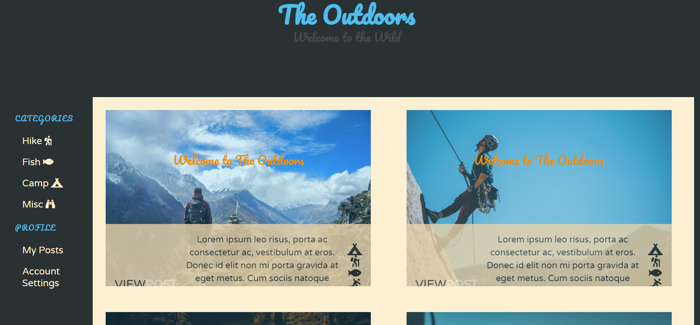

# blog-style-guide

## ABOUT

This is a design mockup for an outdoors blog, created with custom CSS, Bulma in-line styling, and HTML.  The image cards are responsive, and the navbar moves from the left to the top of the screen for tablets and mobile. In addition to Bulma, the page incorporates Google Fonts and Font Awesome Icons. This is an ongoing project. My next goal is to get the same responsiveness on mobile as the site has on desktop.

### SCREENSHOT

